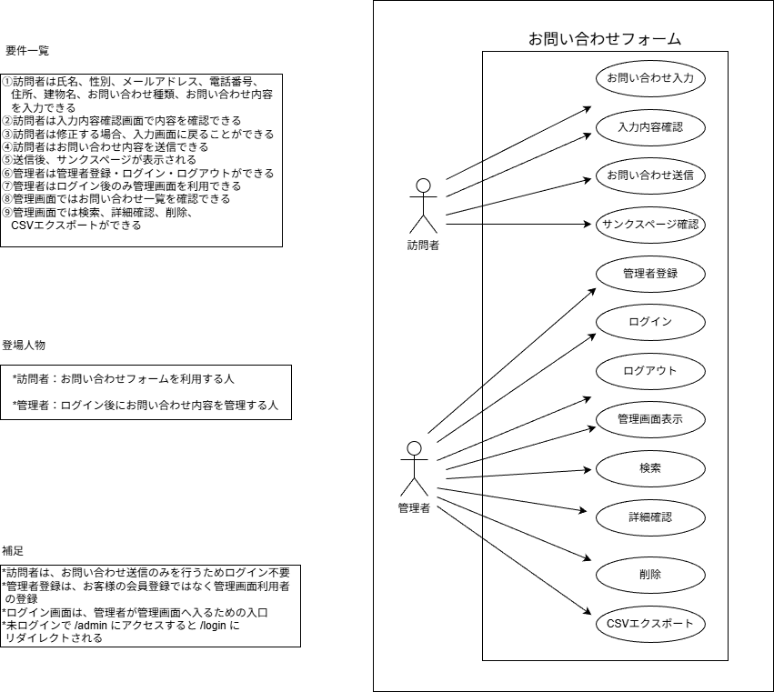
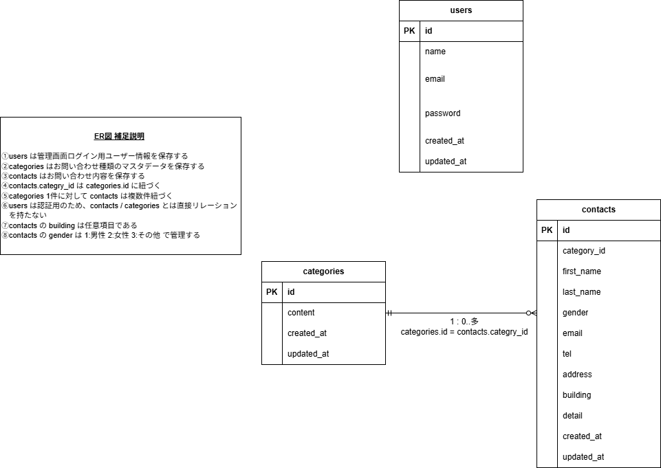

## アプリケーション名

基礎学習ターム 確認テスト\_お問い合わせフォーム

## 概要

お問い合わせフォームアプリです。
一般ユーザーはお問い合わせ内容を入力・確認・送信できます。
管理者はログイン後、管理画面でお問い合わせ内容の一覧確認、検索、詳細表示、削除、CSVエクスポートを行えます。

## 実装機能

- お問い合わせ入力機能
- 入力内容確認機能
- お問い合わせ内容保存機能
- FormRequestを使用したバリデーション機能
- サンクスページ表示機能
- 管理画面表示機能
- お問い合わせ検索機能
  - 名前検索
  - メールアドレス検索
  - 性別検索
  - お問い合わせ種類検索
  - 日付検索
- お問い合わせ詳細表示機能（モーダル）
- お問い合わせ削除機能
- CSVエクスポート機能
- ユーザー登録機能
- ログイン機能
- ログアウト機能
- 認証ユーザーのみ管理画面へアクセス可能

## 訂正版ブランチについて

このブランチ `masuda-kadai1-update` は、確認テスト提出後に模範解答と比較し、提出用アプリの書き方をできるだけ残しながら不足していた要件を修正した訂正版です。

### 主な修正内容

- `ContactFactory.php` を追加
- `ContactsTableSeeder.php` を追加
- `DatabaseSeeder.php` からカテゴリー・お問い合わせデータのSeederを呼び出すよう修正
- `contacts` のダミーデータ35件を作成
- `category_id` に命名を統一
- 管理画面で7件表示・5ページ表示を確認
- 確認画面の「修正」ボタンで入力内容を保持できるよう修正
- 削除ボタンを一覧ではなく詳細モーダル内へ移動
- CSVエクスポートで日本語文字化けと電話番号の先頭0落ちに対応

### 確認済み内容

- フォーム入力
- バリデーション
- 確認画面
- 修正ボタンでの入力保持
- 送信・DB保存
- thanks画面表示
- 管理画面ログイン
- 35件ダミーデータ表示
- 7件ごとのページネーション
- 検索・リセット
- CSVエクスポート
- 詳細モーダル内での削除

---

# 環境構築

## Dockerビルド

...

## 環境構築

### 1. リポジトリからダウンロード

```bash
git clone git@github.com:Mussy649/masuda-kadai1.git
```

### 2. 「.env.example」をコピーして「.env」を作成し、DBの設定を変更

```bash
cp .env.example .env
```

`.env` ファイル内の該当箇所を以下のように変更します。

```env
DB_CONNECTION=mysql
DB_HOST=mysql
DB_PORT=3306
DB_DATABASE=laravel_db
DB_USERNAME=laravel_user
DB_PASSWORD=laravel_pass
```

### 3. Dockerコンテナを構築・起動

```bash
docker-compose up -d --build
```

### 4. phpコンテナにログインしてComposer依存パッケージをインストール

```bash
docker-compose exec php bash
composer install
```

### 5. アプリケーションキーを作成

```bash
php artisan key:generate
```

### 6. DBのテーブルを作成

```bash
php artisan migrate
```

### 7. DBのテーブルに初期データを投入

```bash
php artisan db:seed
```

※ `php artisan db:seed` で categories の初期データが入らない場合は、以下を実行してください。

```bash
php artisan db:seed --class=CategoriesTableSeeder
```

### 8. キャッシュをクリア

```bash
php artisan optimize:clear
```

### 9. 権限エラーが発生した場合

`The stream or file could not be opened` エラーが発生した場合は、`src` ディレクトリ内の `storage` ディレクトリに権限を設定します。

```bash
chmod -R 777 storage
```

## 使用技術（実行環境）

- PHP 8.1
- Laravel 8.x
- Laravel Fortify
- MySQL
- nginx
- Docker / Docker Compose

## URL

- お問い合わせフォーム：http://localhost/
- ユーザー登録：http://localhost/register
- ログイン：http://localhost/login
- 管理画面：http://localhost/admin

※ 管理画面はログイン後のみアクセス可能です。  
初回利用時は `/register` からユーザー登録を行い、その後 `/admin` にアクセスしてください。

## ユースケース図



## ER図



## 補足

提出時点では、課題資料の表記に合わせてお問い合わせ種類のカラム名を `categry_id` / `categy_id` としていましたが、模範解答およびLaravelの命名慣習に合わせ、訂正版ブランチでは `category_id` に統一しました。

これにより、contacts テーブル、Contactモデル、Categoryモデル、Controller、Blade、Factory、Seeder のすべてで `category_id` を使用しています。
